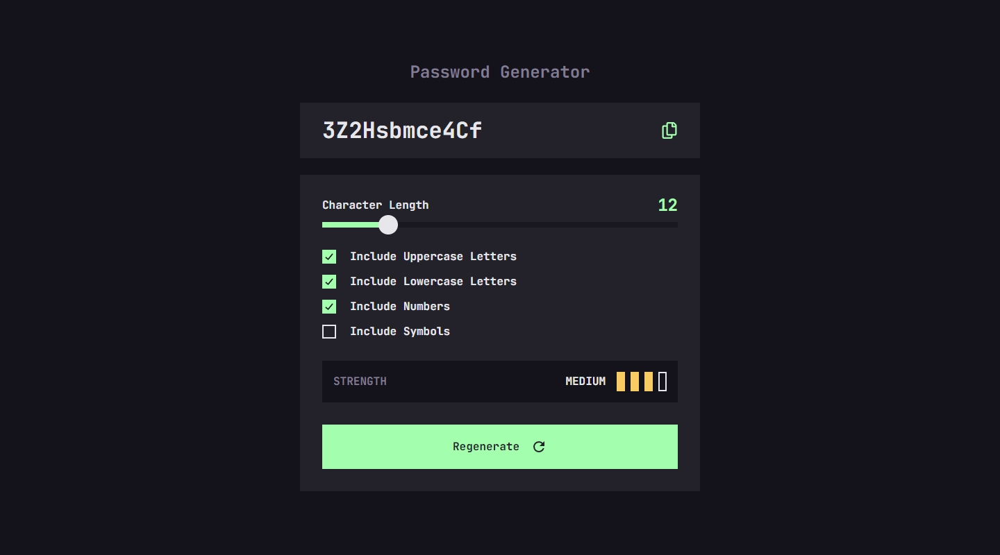
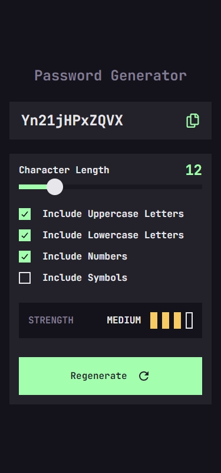

## Frontend Mentor Challenge 27 - Password Generator App

This is my solution to the [Password Generator App](https://www.frontendmentor.io/challenges/password-generator-app-Mr8CLycqjh) challenge on [Frontend Mentor](https://www.frontendmentor.io/).

#

### Links. 🔗

- Live Site URL: https://password-generator-darkstarxdd.vercel.app/
- [PageSpeed Result](https://pagespeed.web.dev/analysis/https-password-generator-darkstarxdd-vercel-app/9277x44amo?form_factor=mobile)

#

### Screenshots of the Solution (Desktop & Mobile). 🔍

#

### Built with. 🔨

- React
- TypeScript
- Tailwind
- Radix Primitives - for the Slider component
- Vite

#

### Features. ✨

- Generate a new random password based on the password options user selects.
- A new password is generated on page load and every time the user makes a change to an input or when the "Regenerate" button is clicked.
- User can copy the generated password to the clipboard by clicking a button.

#

### New Things Learned. 🎓

- This was my first time using a headless UI library.

#

- Some tools i use - [DarkstarXDD/tools](https://gist.github.com/DarkstarXDD/4b1844eda12f34b667a0c36e05fcbdf9)
- My Frontend Mentor profile - [@DarkstarXDD](https://www.frontendmentor.io/profile/DarkstarXDD)
